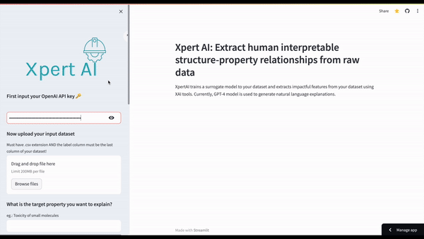

# XpertAI
 [](https://xpert-ai.streamlit.app/)
 [](https://lbesson.mit-license.org/)
 [](https://github.com/geemi725/XpertAI) 
 [](https://doi.org/10.48550/arXiv.2311.04047)

### A package to extract structure-property relationships as natural language explanations
XpertAI harnesses the power of XAI and LLMs to uncover structure-property relationships and present them in 
natural language. Checkout the [streamlit app](https://xpert-ai.streamlit.app/)!


 
XpertAI NLEs are specific to a given dataset/task, provide scientific explanations, and are highly 
accessible to non-technical experts. Currently, GPT-4 model is used to generate natural language explanations.


## XpertAI's backend functions 
To facilitate the extraction of natural language explanations from raw data, XpertAI makes use of the following functionalities in the backend:
- Generating natural language XAI explanations from SHAP and LIME.
- Automatic generation of citations by reading the first page of a publication (consistent with scientific publications).
- Automatic refinement of feature labels in the raw dataset to increase human interpretability.
- Chain-of-thought prompting to generate scientific explanations.


## How to use

1. Go to the [streamlit app](https://xpert-ai.streamlit.app/)
2. Add your OpenAI key. Helpful resources: [API-reference](https://platform.openai.com/docs/api-reference)
3. Upload your featurized raw dataset. Currently, XpertAI requires your dataset to be a ``csv file`` containing inputs and outputs. The input dataset should be featurized before upload eg; SMILES converted to MACCS keys. The **Note**: Your target labels must be in the last column of the dataset!!! XpertAI automatically selects the last column as the label column. Also make sure you use human interpretable descriptor/feature headers in your dataset. XpertAI will use these headers to extract structure-property relationships. A sample dataset for toxicity prediction task can be found at `paper/datasets` folder.
4. Select the surrogate model type: ``Regressor`` or ``Classifier``
5. Select your favorite XAI tool: ``SHAP`` ``LIME`` or ``Both``
6. Select how many features would you like in your final explanation. eg. if you select 3, XperAI will use the top 3 features from the XAI analysis to draw relationships.
7. Provide literature to help XperAI make scientific explanations. You can either upload multiple publications (as PDFs) or ask XpertAI to scrape ``arxiv.org`` for relevant papers. 
In this case, you can add keywords to search arxiv and set the maximum number of references to be downloaded. **Note**: We have seen better performance with curated literature datasets as they are more specific.  
8. Finally tell XpertAI what is the property you'd like explained. eg. "Solubility of small molecules". Click the ``Generate Explanation`` button to begin! Once the explanation is generated you can download it along with train-test error plot and the XAI plots.

## A quick demo


This video is made faster for demonstration purposes. General run time in the streamlit app is ~3 minutes. But this may vary depending on the size of the dataframe and the literature dataset.

## Run Locally
After installing the required packages given in [reference.txt](https://github.com/geemi725/XpertAI/blob/main/requirements.txt), a user can run the streamlit app locally with `streamlit run app.py`
## Cite our work
Wellawatte, Geemi P., and Philippe Schwaller. "Extracting human interpretable structure-property relationships in chemistry using XAI and large language models." arXiv preprint arXiv:2311.04047 (2023).

```bibtex
@article{wellawatte2023extracting,
  title={Extracting human interpretable structure-property relationships in chemistry using XAI and large language models},
  author={Wellawatte, Geemi P and Schwaller, Philippe},
  journal={arXiv preprint arXiv:2311.04047},
  year={2023}
}
```

