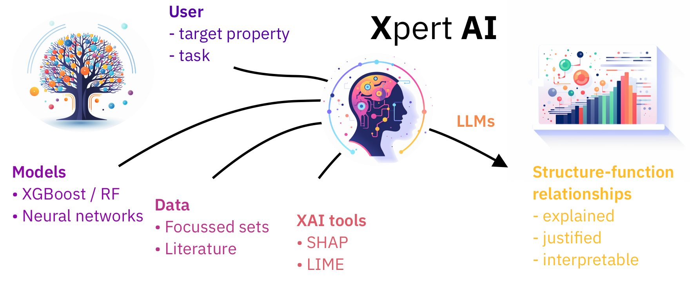
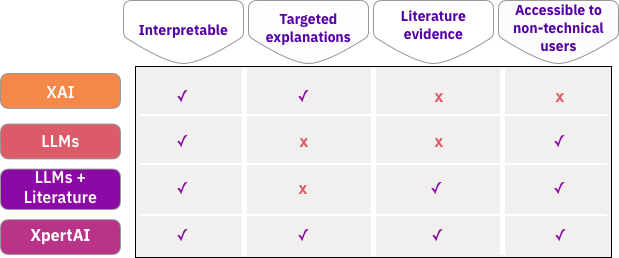

# XpertAI
 
 
  

### A package to extract structure-property relationships as natural language explanations

XpertAI harnesses the power of XAI and LLMs to uncover structure-property relationships and present them in 
natural language. 
XpertAI NLEs are specific to a given dataset/task, provide scientific explanations, and are highly 
accessible to non-technical experts. 

## How to use

1. Go to the [streamlit app](https://xpert-ai.streamlit.app/)
2. Add your OpenAI key. Helpful resources: [API-reference](https://platform.openai.com/docs/api-reference)
3. Upload your featurized raw dataset. Currently, XpertAI requires your dataset to be a ``csv file``. **Note**: Your target labels must be in the last column of the dataset!!! XpertAI automatically selects the last column as the label column. Also make sure you use human interpretable descriptor/feature headers in your dataset. XpertAI will use these headers to extract structure-property relationships.
4. Select the surrogate model type: ``Regressor`` or ``Classifier``
5. Select your favorite XAI tool: ``SHAP`` ``LIME`` or ``Both``
6. Select how many features would you like in your final explanation. eg. if you select 3, XperAI will use the top 3 features from the XAI analysis to draw relationships.
7. Provide literature to help XperAI make scientific explanations. You can either upload multiple publications (as PDFs) or ask XpertAI to scrape ``arxiv.org`` for relevant papers. 
In this case, you can add keywords to search arxiv and set the maximum number of references to be downloaded. **Note**: We have seen better performance with curated literature datasets as they are more specific.  
8. Finally tell XpertAI what is the property you'd like explained. eg. "Solubility of small molecules". Click the ``Generate Explanation`` button to begin! Once the explanation is generated you can download it along with train-test error plot and the XAI plots.
